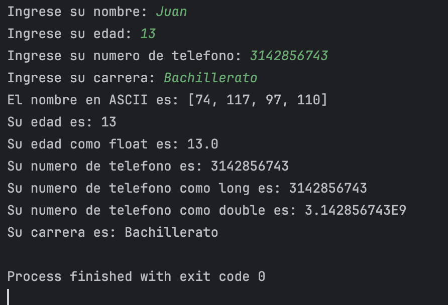
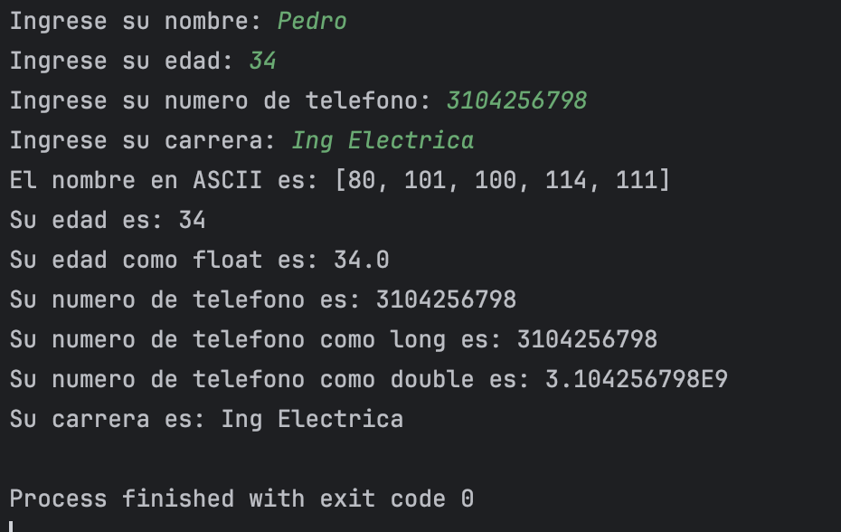

## Descripción
Este programa en Java solicita al usuario que ingrese su nombre, edad, número de teléfono y carrera. Posteriormente, realiza conversiones de tipo de dato y muestra los resultados.

Las acciones principales del programa son:
- Convertir el nombre ingresado en un arreglo de valores ASCII.
- Convertir la edad (`int`) a tipo `float`.
- Convertir el número de teléfono (`String`) a los tipos `long` y `double`.
- Imprimir todos los valores ingresados y convertidos.

## Instrucciones de uso
1. Ejecuta el programa.
2. Ingresa los datos solicitados por el sistema:
    - Nombre
    - Edad
    - Número de teléfono
    - Carrera
3. Observa en consola las conversiones realizadas y los datos desplegados.

## Ejemplo de salida

